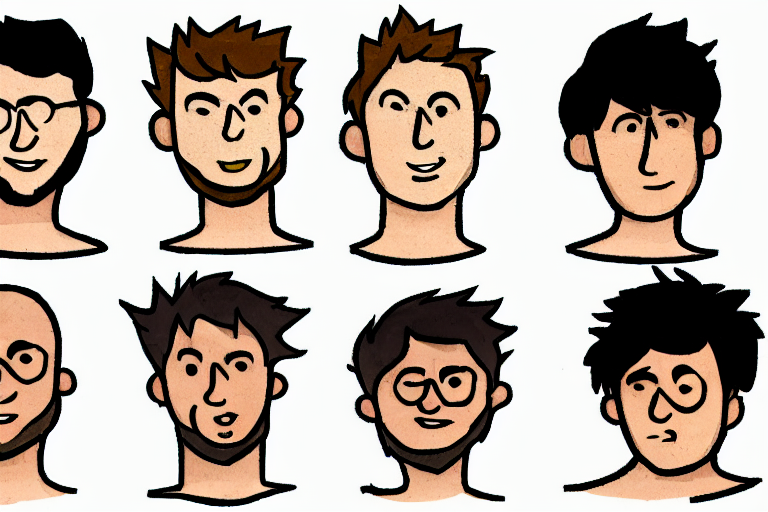

# Test de personalidad 

Prueba de personalidad de las personas con unas preguntas simples.

## Tabla de Contenidos

- [Requisitos Previos](#requisitos-previos)
- [Uso](#uso)
- [Licencia](#licencia)

## Requisitos Previos

1. Eliga las opcion de su preferencia con Mayusculas.
2. Si no marca ninguna opción, no sera considerada para el test.

## Uso

El proyecto puede ser usado desde su ide de preferencia:

## Tecnologia Utilizada

 

## Licencia

